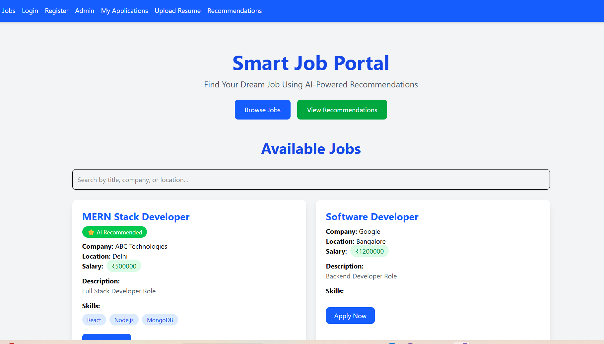
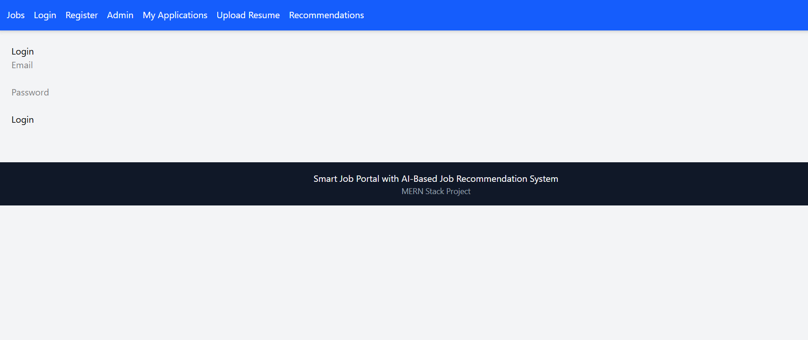
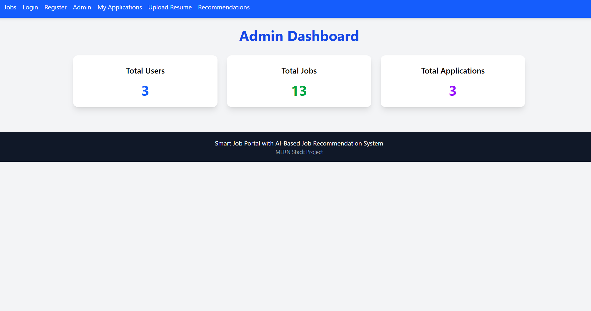

# Smart Job Portal with AI-Based Job Recommendation System

## Overview

Smart Job Portal is a MERN Stack web application that helps job seekers find relevant jobs based on their skills and profile. The platform includes authentication, job applications, resume uploads, admin analytics, and an AI-based recommendation engine that matches user skills with job requirements.

---

## Features

### User Features

- User Registration
- User Login using JWT Authentication
- Browse Available Jobs
- Search Jobs by Title, Company, or Location
- Apply for Jobs
- View Applied Jobs
- Upload Resume
- AI-Based Job Recommendations

### Admin Features

- Admin Login
- Create Job Listings
- Dashboard Analytics
- View Total Users
- View Total Jobs
- View Total Applications

### AI Recommendation Engine

- Skill Matching Algorithm
- Match Percentage Calculation
- Personalized Job Recommendations
- Recommended Job Highlighting

---

## Tech Stack

### Frontend

- React.js
- React Router DOM
- Axios
- Tailwind CSS
- Vite

### Backend

- Node.js
- Express.js
- JWT Authentication
- Multer (Resume Upload)

### Database

- MongoDB Atlas
- Mongoose

---

## Project Architecture

Frontend (React + Tailwind CSS)
↓
Backend API (Node.js + Express)
↓
MongoDB Atlas Database
↓
AI Recommendation Engine

---

## AI Recommendation Logic

The recommendation system compares:

User Skills

VS

Required Skills of Jobs

Formula:

Match Percentage =

(Number of Matching Skills / Total Required Skills) × 100

### Example

User Skills:

- React
- Node.js
- MongoDB

Job Skills:

- React
- Node.js
- MongoDB

Result:

- Match Percentage = 100%

---

## Main Modules

### Authentication Module

- Register User
- Login User
- JWT Token Generation
- Protected Routes

### Job Module

- Create Jobs
- View Jobs
- Search Jobs
- Apply Jobs

### Application Module

- Apply for Job
- View My Applications

### Resume Module

- Upload Resume
- Store Resume Path

### Recommendation Module

- Skill Matching
- Job Ranking
- Recommendation Percentage

### Admin Module

- Dashboard Statistics
- User Count
- Job Count
- Application Count

---

## Screenshots

### Home Page



### Login Page



### Recommendations Page


### My Applications


### Resume Upload


### Admin Dashboard



---

## Installation

### Clone Repository

```bash
git clone <repository-url>
```

### Backend Setup

```bash
cd backend
npm install
```

Create `.env` file:

```env
MONGO_URI=your_mongodb_connection_string
JWT_SECRET=your_secret_key
PORT=5000
```

Run Backend:

```bash
npm run dev
```

### Frontend Setup

```bash
cd frontend
npm install
npm run dev
```

---

## Test Accounts

### Admin

```txt
Email: admin@example.com
Password: ********
```

### User

```txt
Email: user@example.com
Password: ********
```

---

## Future Enhancements

- Resume Skill Extraction
- Machine Learning Recommendation Model
- Interview Scheduling
- Email Notifications
- Company Profiles
- Saved Jobs Feature
- Advanced Analytics Dashboard

---

## Project Highlights

✅ JWT Authentication

✅ Role-Based Access Control

✅ Resume Upload System

✅ AI-Based Job Recommendation Engine

✅ Admin Dashboard

✅ Search Functionality

✅ Tailwind CSS Responsive UI

✅ MongoDB Atlas Integration

---

## Author

Harshita Vashisht

B.Tech Engineering Student

Smart Job Portal with AI-Based Job Recommendation System